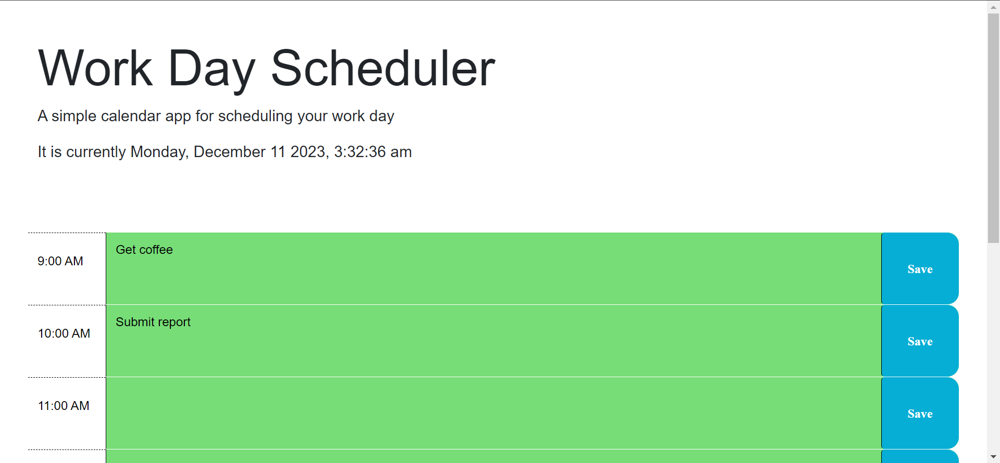
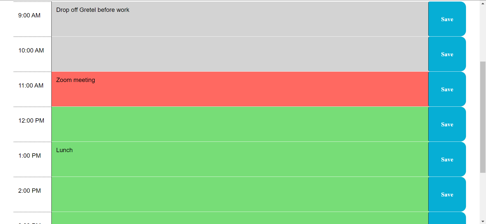

# Work Day Scheduler

## Description

This application is a simple scheduling tool that can be used to plan your work day. The time blocks of this scheduler span the typical working hours of 9:00 am to 5:00 pm. Users can enter and save their hourly events and easily see which events are upcoming, current, or past based on the color scheme of each hour.

The purpose of this application is to assist users with planning and visualizing an hourly schedule of activities such as work, meetings, or errands. The application displays the current date and time at the top of the page, and changes the color of the hour blocks based on whether that hour has passed, is current, or has yet to pass. All these features help users keep track of their events so they can stay on top of their responsibilities.

While working on this project, I learned how to use jQuery objects and methods. I also learned how to utilize the Day.js library to get current dates and times to display and compare the values in my own code. Finally, I was able to become more familiar with using local storage to save and display browser data, specifically how to give data unique identifiers and render them in unique locations while still keeping the functions simple and effective.

## Installation

N/A

## Usage

To view this webpage, enter the URL [https://eaeidsath.github.io/Work-Day-Scheduler/](https://eaeidsath.github.io/Work-Day-Scheduler/) into any browser and scroll to see the webpage contents.

To use the calendar, click on the empty space next to each hour to begin typing in your events. After you have finished typing, click that hour's save button, which is to the right of the text box, to save your events.

Upon refreshing the page, your saved events will still be displayed. To change or remove an event, edit the text in the box and click the save button again.

### Screenshots

## Credits
Evelyn Eidsath [https://github.com/eaeidsath](https://github.com/eaeidsath)
George [https://github.com/Georgeyoo](https://github.com/Georgeyoo)
Xander Rapstine [https://github.com/Xandromus](https://github.com/Xandromus)
Courtney Mathena [https://github.com/courtthecoop](https://github.com/courtthecoop)
Matt Fyke [https://github.com/mfyke](https://github.com/mfyke)